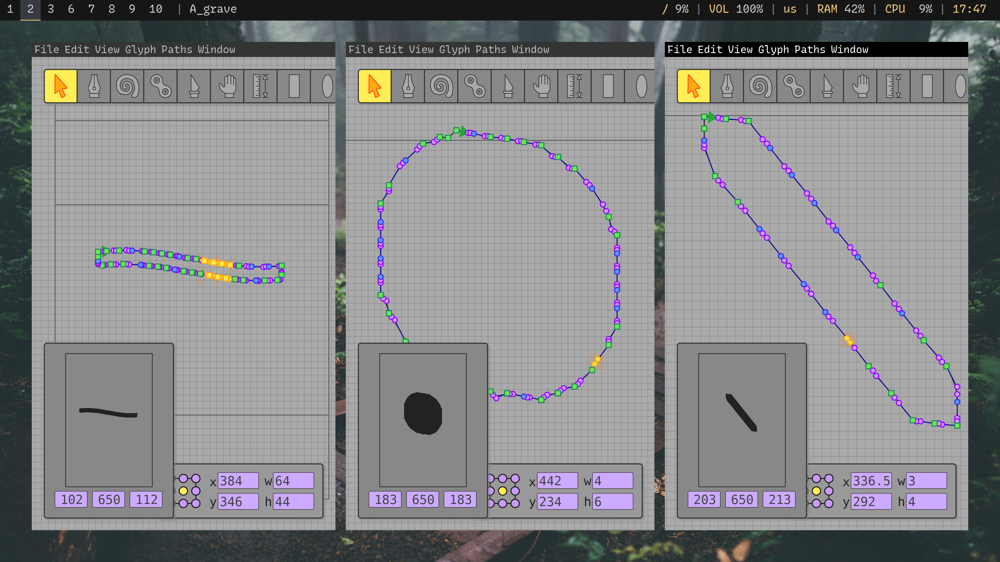

# UFO PyTorch Scripts

This project consists of a collection of Python scripts used to train neural networks on UFO font source files, and aditional scripts that use the generated models to automate labor intensive tasks in type design workflows.

These scripts are very alpha quality and are created by a font engineer, not an experianced machine learning engineer. All training data used for this project is licensed under the SIL Open Font License.




## Overview

- `train_ufo_model.py`: Trains a neural network on a dataset of UFO fonts
- `generate_glyphs.py`: Uses the trained model to generate new glyphs for a given input font

## Usage

### Training a Model

To train a model on a dataset of UFO fonts:
```bash
python train_ufo_model.py --dataset dataset
```

This will:
1. Load all UFO fonts from the specified dataset directory
2. Train a GlyphGenerator model on the glyphs
3. Save the trained model to a corresponding model directory (e.g., `model/glyph_generator.pth`)

### Generating Glyphs

To generate new glyphs using a trained model:
```bash
python generate_glyphs.py --input input.ufo --output output.ufo --model model
```

This will:
1. Load the trained model from the specified model directory
2. Copy all glyphs from the input font to the output font
3. Generate new glyphs for missing characters
4. Save the expanded font to the output path

## How It Works

### Training Process

1. The script converts each glyph in the training fonts to a 64x64 binary image
2. These images are used to train a convolutional neural network
3. The network learns to understand the common features and styles of the font

### Generation Process

1. For each missing glyph, the script creates a basic shape hint
2. The trained model generates a detailed outline based on this hint
3. The outline is converted to proper font coordinates and curves
4. The new glyph is added to the output font

## Notes

- The quality of generated glyphs depends on the quality and variety of the training data
- The model works best when generating glyphs that are similar to those in the training set
- Multiple datasets (dataset-a, dataset-b, etc.) can be used to train different models for different styles

## License

MIT

